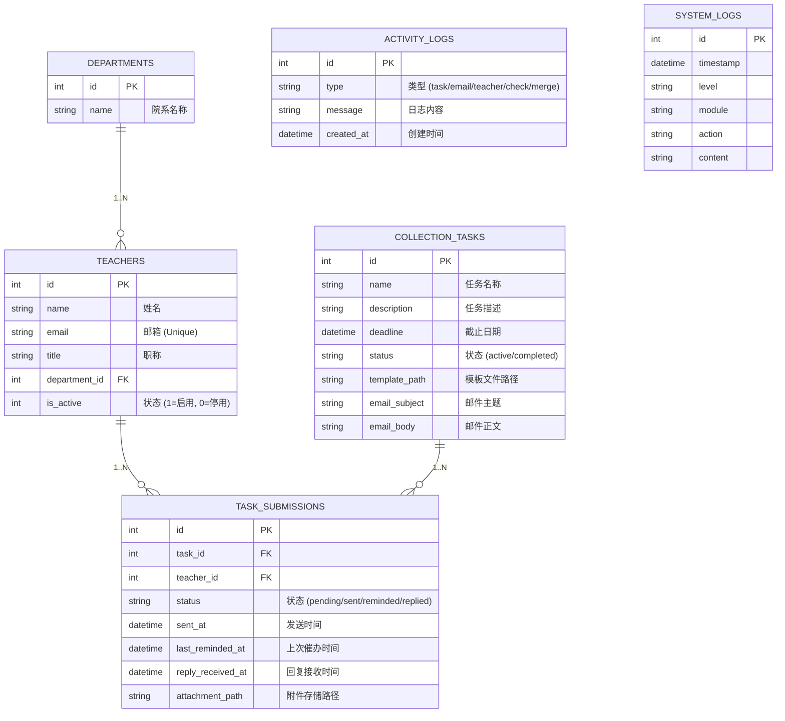

# 高校科研/教学数据自动汇总系统 - 用户手册与技术文档

## 1. 系统概述
本系统旨在帮助高校行政人员自动化处理繁琐的数据收集工作（如科研成果统计、教学工作量核对等）。系统通过邮件自动分发任务模板，自动抓取教师回复的邮件附件，并提供一键合并汇总功能，极大地提高了工作效率。

### 核心功能
- **任务管理**：创建数据收集任务，上传Excel模板，自定义邮件通知。
- **邮件自动化**：自动群发通知邮件，支持针对未回复教师的一键催办。
- **智能回执**：通过IMAP协议自动扫描邮箱，识别教师回复并下载附件。
- **数据汇总**：一键合并所有教师提交的Excel文件，生成总表。
- **AI 助手**：集成LLM（如DeepSeek），支持自然语言查询数据库和生成邮件内容。

---

## 2. 数据模型 (ER Diagram)

系统采用 SQLite 数据库（可切换至 MySQL/PostgreSQL），主要包含以下实体关系：



### 关系说明
1.  **Departments - Teachers**: 一个院系包含多名教师。
2.  **Teachers - TaskSubmissions**: 一名教师在不同任务中对应多条提交记录。
3.  **CollectionTasks - TaskSubmissions**: 一个任务包含发给所有教师的提交记录。

---

## 3. 部署指南

### 3.1 环境要求
- **操作系统**: Linux / Windows / macOS
- **后端**: Python 3.10+
- **前端**: Node.js 18+
- **外部服务**: SMTP/IMAP 邮箱服务 (推荐 QQ邮箱或学校企业邮)

### 3.2 后端部署
1.  进入后端目录：
    ```bash
    cd backend
    ```
2.  创建并激活虚拟环境：
    ```bash
    python3 -m venv venv
    source venv/bin/activate  # Windows: venv\Scripts\activate
    ```
3.  安装依赖：
    ```bash
    pip install -r requirements.txt
    ```
4.  配置环境变量：
    复制 `.env.example` 为 `.env` 并填入配置：
    ```ini
    # 数据库
    DATABASE_URL=sqlite:///./sql_app.db
    
    # 邮件服务 (必须配置以使用核心功能)
    SMTP_SERVER=smtp.qq.com
    SMTP_PORT=465
    EMAIL_USER=your_email@qq.com
    EMAIL_PASSWORD=your_auth_code  # 邮箱授权码，非登录密码
    IMAP_HOST=imap.qq.com
    IMAP_PORT=993
    
    # LLM 配置 (可选)
    LLM_PROVIDER=deepseek
    LLM_API_KEY=sk-xxxxxx
    ```
5.  初始化数据库：
    ```bash
    python migrate_db.py
    ```
6.  启动服务：
    ```bash
    uvicorn app.main:app --host 0.0.0.0 --port 8000 --reload
    ```

### 3.3 前端部署
1.  进入前端目录：
    ```bash
    cd frontend
    ```
2.  安装依赖：
    ```bash
    npm install
    ```
3.  启动开发服务器：
    ```bash
    npm run dev -- --host 0.0.0.0
    ```
4.  访问地址：`http://localhost:5173`

---

## 4. 用户操作手册

### 4.1 仪表盘 (Dashboard)
- **数据概览**：查看教师总数、进行中的任务、待回复数及整体完成率。
- **最新动态**：实时显示系统的关键操作日志（如“标记教师为已回复”、“合并了5个文件”等）。
- **快捷操作**：
    - **刷新数据**：点击右上角刷新按钮获取最新统计。

### 4.2 教师管理 (Teacher Management)
- **添加教师**：手动输入姓名、邮箱、职称和院系。
- **批量导入**：支持上传 Excel/CSV 文件批量导入教师名单。
    - *文件格式要求*：需包含 `name`, `email`, `department` 列。
- **编辑/删除**：可修改教师信息或将其从系统中移除。

### 4.3 任务管理 (Task Management) - **核心功能**
#### 1. 创建任务
- 点击“新建任务”。
- 填写任务名称、截止日期。
- **上传模板**：上传一个 Excel 文件作为统计模板（如《2025科研统计表.xlsx》）。
- **AI 辅助**：在任务说明或邮件正文中输入 `/` 开头的内容，可调用 AI 自动生成文案。
- **选择教师**：默认全选，也可手动勾选特定教师。

#### 2. 任务详情与追踪
- 在左侧列表选择一个任务，右侧显示详细信息。
- **提交记录列表**：
    - 显示每位教师的状态：`待回复 (Pending)`、`已催办 (Reminded)`、`已回复 (Replied)`。
    - 显示上次催办时间和回复接收时间。

#### 3. 邮件通知与催办
- **发送汇总邮件**：点击“发送汇总邮件”，系统将带上模板附件群发给所有未完成的教师。
- **一键催办**：点击“提醒全部未回复”，系统仅向状态非“已回复”的教师发送催办邮件。

#### 4. 检查回复 (Check Replies)
- 点击 **“检查回复”** 按钮。
- 系统会自动登录配置的 IMAP 邮箱，扫描最近收到的邮件。
- **匹配规则**：
    1. 发件人邮箱必须匹配系统中的教师邮箱。
    2. **邮件主题必须包含任务名称**（如“2025年度科研成果统计”）。
    3. 优先提取带有附件的邮件。
- 匹配成功后，系统会自动下载附件，并将该教师状态更新为 `已回复`。

#### 5. 合并附件 (Merge Attachments)
- 当收集到一定数量的回复后，点击 **“合并附件”**。
- 系统会将所有已回复教师的 Excel 附件合并为一个总表。
- 合并完成后，浏览器会自动下载 `merged_output.xlsx`。

### 4.4 智能助手 (AI Chat)
- 支持自然语言对话。
- **SQL 查询**：可以问“统计一下哪个院系的回复率最高？”，助手会生成 SQL 并查询数据库。
- **邮件生成**：可以要求“帮我写一封催交科研统计的邮件，语气委婉一点”。

---

## 5. 常见问题 (FAQ)

**Q: 为什么“检查回复”找不到邮件？**
A: 请确认：
1. 教师回复的邮件主题是否包含了完整的任务名称。
2. 教师是否使用了系统登记的邮箱进行回复。
3. 后端 `.env` 中的 `IMAP_HOST` 和密码配置是否正确。

**Q: 合并附件失败怎么办？**
A: 确保教师回复的附件是有效的 Excel 文件。如果某个文件损坏，可能会导致合并中断。

**Q: 如何修改数据库结构？**
A: 修改 `backend/app/models.py` 后，需要手动处理数据库迁移（SQLite）或删除 `sql_app.db` 重新初始化（注意数据会丢失）。
